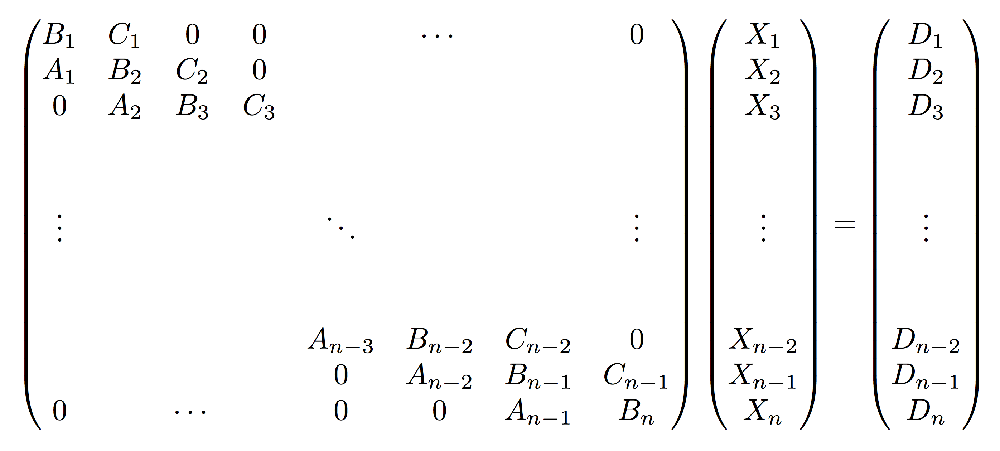

# tridiagonal

`tridiagonal` is a C++ template library with solvers for tridiagonal block matrix systems.
## Solvers 
`tridiagonal::solve_tridiagonal` solves block matrix systems on the form

<p align="center">

</p>

`tridiagonal::solve_off_tridiagonal` solves block matrix systems on the form

<p align="center">

</p>


## Installation

[Eigen](http://eigen.tuxfamily.org) is used for linear algebra structures and operations.

To install the library clone the repository and copy the [tridiagonal](tridiagonal/) directory to the desired install location. 

## Example

```cpp
//
//        LHS       X   =  RHS
//
//  | b0  c0  0  | |x1|   |d0|
//  | a1  b1  c1 | |x2| = |d1|
//  | 0   a2  b2 | |x3|   |d2|
//

#include <eigen3/Eigen/Dense>
#include <tridiagonal/tridiagonal>

int main(){

    Eigen::Matrix<double, 6, 6> LHS;

    LHS <<    0, 3,  1, 2,  0, 0,
              2, 1,  4, 5,  0, 0,

              6, 7,  1, 2,  4, 5,
              1, 3,  9, 0,  2, 3,

              0, 0,  2, 1,  5, 2,
              0, 0,  3, 7,  9, 3;

    Eigen::Matrix<double, 6, 1> RHS;
    RHS <<    0,
              2,
              3,
              1,
              -9,
              2;

    Eigen::Matrix2d a1, a2, b0, b1, b2, c0, c1;
    b0 = LHS.block(0, 0, 2, 2);
    b1 = LHS.block(2, 2, 2, 2);
    b2 = LHS.block(4, 4, 2, 2);

    c0 = LHS.block(0, 2, 2, 2);
    c1 = LHS.block(2, 4, 2, 2);

    a1 = LHS.block(2, 0, 2, 2);
    a2 = LHS.block(4, 2, 2, 2);

    Eigen::Vector2d d0, d1, d2;
    d0 = RHS.block(0, 0, 2, 1);
    d1 = RHS.block(2, 0, 2, 1);
    d2 = RHS.block(4, 0, 2, 1);

    vector<Eigen::Matrix2d> diagonal = {b0, b1, b2};
    vector<Eigen::Matrix2d> lower_diagonal = {a1, a2};
    vector<Eigen::Matrix2d> upper_diagonal = {c0, c1};
    vector<Eigen::Vector2d> rhs = {d0, d1, d2};

    vector<Eigen::Vector2d> solution = tridiagonal::solve_tridiagonal(lower_diagonal,
                                                                      diagonal,
                                                                      upper_diagonal,
                                                                      rhs);

    Eigen::Matrix<double, 6, 1> tridiagonal_X;
    tridiagonal_X.block(0, 0, 2, 1) = solution[0];
    tridiagonal_X.block(2, 0, 2, 1) = solution[1];
    tridiagonal_X.block(4, 0, 2, 1) = solution[2];

    Eigen::Matrix<double, 6, 1> eigen_X = LHS.fullPivHouseholderQr().solve(RHS);

    assert(tridiagonal_X.isApprox(eigen_X));
}
```

## Tests

The solvers are unit tested with [Catch2](https://github.com/catchorg/Catch2). To compile and run the unit tests make sure that tridiagonal, Eigen and Catch2 are in the include path and run

```bash
$ gcc tests/*.cpp -o test.out -std=c++11
$ ./test.out
```
